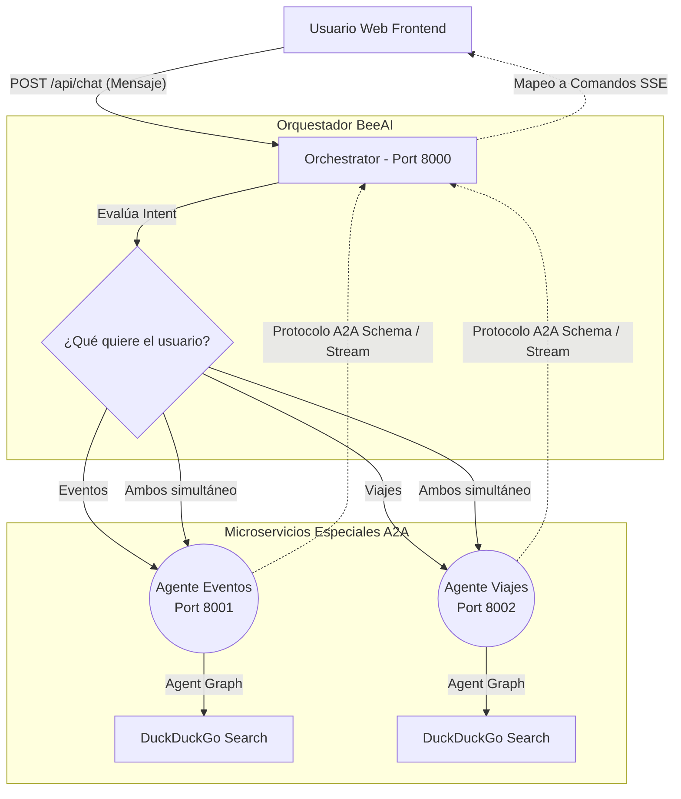
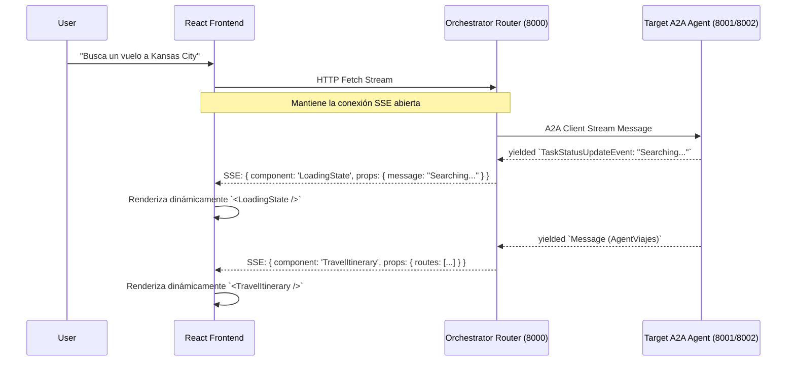
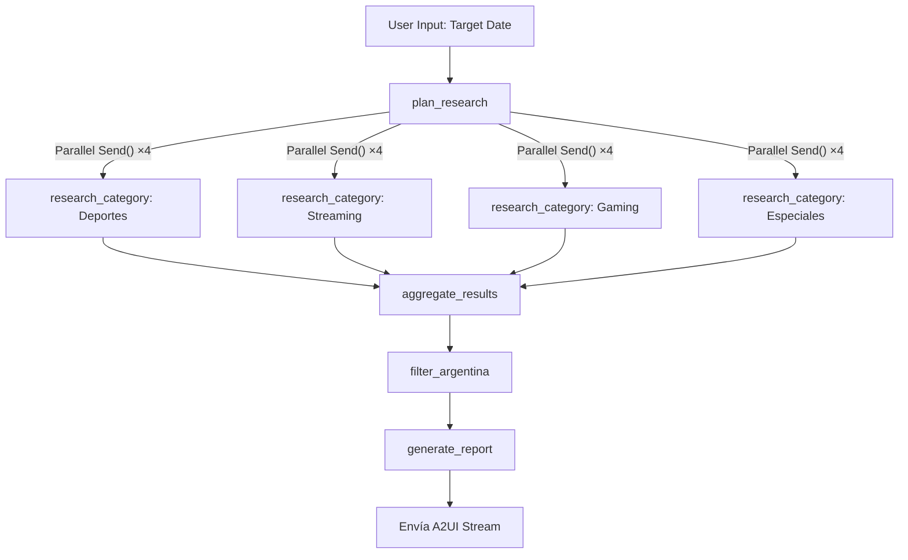

# Deep Research & Events Platform

Este proyecto es una plataforma fullstack orquestada de múltiples agentes (Multi-Agent System), diseñada para investigar eventos relevantes y planes de viaje precisos. Aprovecha herramientas de IA avanzadas, el estándar Agent-to-Agent (A2A) de Google y una arquitectura basada en React/FastAPI.

## 🚀 Arquitectura y Componentes
El proyecto se divide en 3 bloques principales: Frontend, Orchestrator y Microservicios de Agentes Especializados. Se usa Server-Sent Events (SSE) para stream en tiempo real y componentes proactivos mediante el patrón *Agent-to-UI* (A2UI).

**1. Orchestrator (BeeAI & FastAPI)**
Actúa como un "Router" Inteligente (usando `llama-3.3-70b-versatile` de Groq). Interpreta la intención semántica del usuario y decide si delegar la tarea al **Agente de Eventos**, al **Agente de Viajes** o de forma concurrente a **ambos**. Usa el framework BeeAI apoyado en el SDK de cliente de A2A para llamar unificadamente a cada servicio.

**2. Agent Eventos (A2A Server, LangGraph)**
Se encarga de rastrear eventos clave (deportes, streamings, gaming) en la red para una fecha u objetivo determinado, utilizando `DuckDuckGo Search` (gratuito y sin API Key). Aplica una ontología de negocios para acortar solo eventos relevantes a la Argentina. Transmite componentes de carga y recolección de eventos en vivo a la web.

**3. Agent Viajes (A2A Server, LangGraph)**
Recibe un origen, destino y fecha. Se encarga de ensamblar planes de transporte e itinerarios mediante búsquedas precisas (DuckDuckGo Search/Vuelos). Envía resultados listos para consumirse visualmente en forma de opciones tabulares.

**4. Frontend (React + Vite)**
Aplicación web moderna responsable de decodificar flujos asíncronos en texto plano (SSE) y transformarlos de inmediato en componentes (A2UI). 

---

## 🖼️ Esquemas de Funcionamiento

### 1. Arquitectura de Sistema (High-Level)


### 2. Flujo del Frontend (UI Stream Rendering)


### 3. Grafo del Agente de Eventos (LangGraph Interno)


---

## 🛠 Instalación y Uso Local

### 1. Variables de Entorno (`.env`)
En la raíz del proyecto, debes configurar tu archivo de variables de entorno. Puedes basarte en el `.env.example` clonándolo:
```bash
cp .env.example .env
```
Abre el archivo `.env` recién creado y actualiza con tus *API Keys* reales:
- **`GROQ_API_KEY`**: Para los modelos LLM subyacentes de ultra-velocidad (Ej. `llama-3.3-70b-versatile` / `llama-4-scout-17b-16e-instruct`).
- **`LANGSMITH_*`** *(opcional)*: Para dar trazabilidad al grafo si deseas inspeccionar los calls internos de langchain.

> **Importante:** El modelo gratuito ("on demand") de Groq tiene límites de Requests (Rate Limits). Los grafos implementan internamente un `Exponential Backoff Timeout Retry` y el cliente manda latidos (*heartbeats*) a la UI por SSE si hay cortes para mantener la conexión viva del browser de manera inteligente.

### 2. Infraestructura y Manejo de Dependencias
Este proyecto utiliza múltiples entornos virtuales. Todos son autogestionados de forma veloz utilizando **uv**, mientras que el orquestador maestro usa **npm** global.

### 3. Ejecución Fullstack 
Con un solo comando se levantan en segundo plano todos los servicios necesarios:

```bash
npm install
npm run dev
```

Esto desplegará **4 procesos paralelos** utilizando el paquete `concurrently`:
1. **Frontend (Vite/React):** \`http://localhost:5173\` (Tu puerta de entrada visual)
2. **Orchestrator (FastAPI):** \`http://localhost:8000\`
3. **Agent Eventos (A2A Server):** \`http://localhost:8001\`
4. **Agent Viajes (A2A Server):** \`http://localhost:8002\`

Una vez que la consola confirme que el Vite server ("`Ready in ... ms`") ya arrancó, **abrilo en tu navegador** para interactuar de este modo:
- **Intención de Eventos:** preguntá "qué eventos ocurren en junio" y verás la tabla respectiva.
- **Intención de Viajes:** preguntá "indicame la combinación de vuelos para salir de CABA a Miami" y el router inteligentemente abrirá la Pestaña Vuelos llamando al agente y dibujando la ruta.
