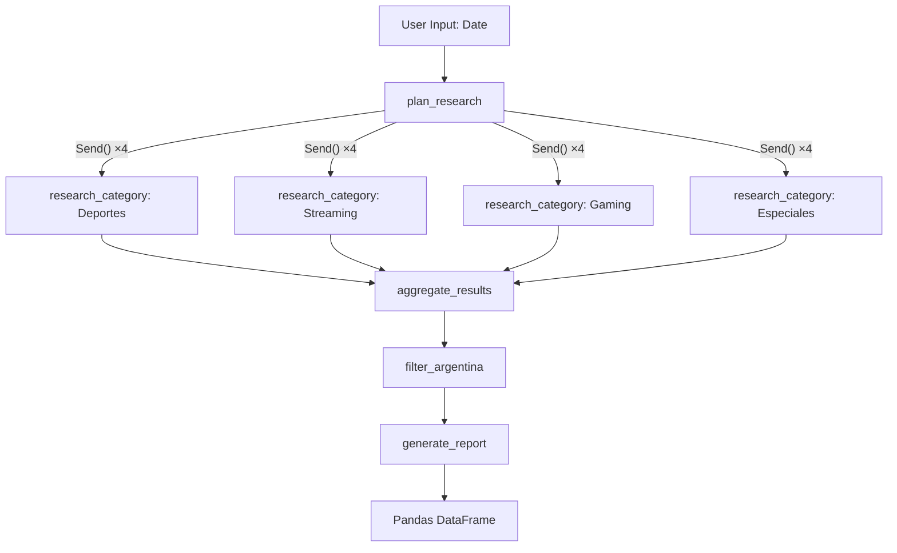

# Deep Research Agent - Eventos Argentina

## What is this project?

This is a LangGraph multi-agent system that searches for events generating internet traffic in Argentina (such as sports, streaming, gaming, and awards ceremonies). It is inspired by [open_deep_research](https://github.com/langchain-ai/open_deep_research).

## Architecture



## Files Overview

| File | Purpose |
|------|---------|
| `.env` | Environment variables (Tavily + OpenAI) |
| `state.py` | Graph states + Pydantic structured outputs |
| `configuration.py` | Agent configuration (models, search params) |
| `prompts.py` | System prompts for Planner, Researcher, Filter, Report |
| `graph.py` | LangGraph StateGraph with `Send()` for parallelism |
| `main.py` | CLI entry point, date input, pandas output |

## How to Run

1. Edit the API keys in your `.env` (use `.env.example` as a template). You'll need credentials for `TAVILY_API_KEY` and `OPENAI_API_KEY`.
2. Ensure you have `uv` installed, then run:

```bash
uv run python main.py
```
