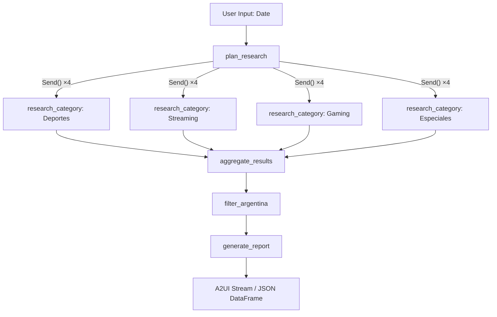
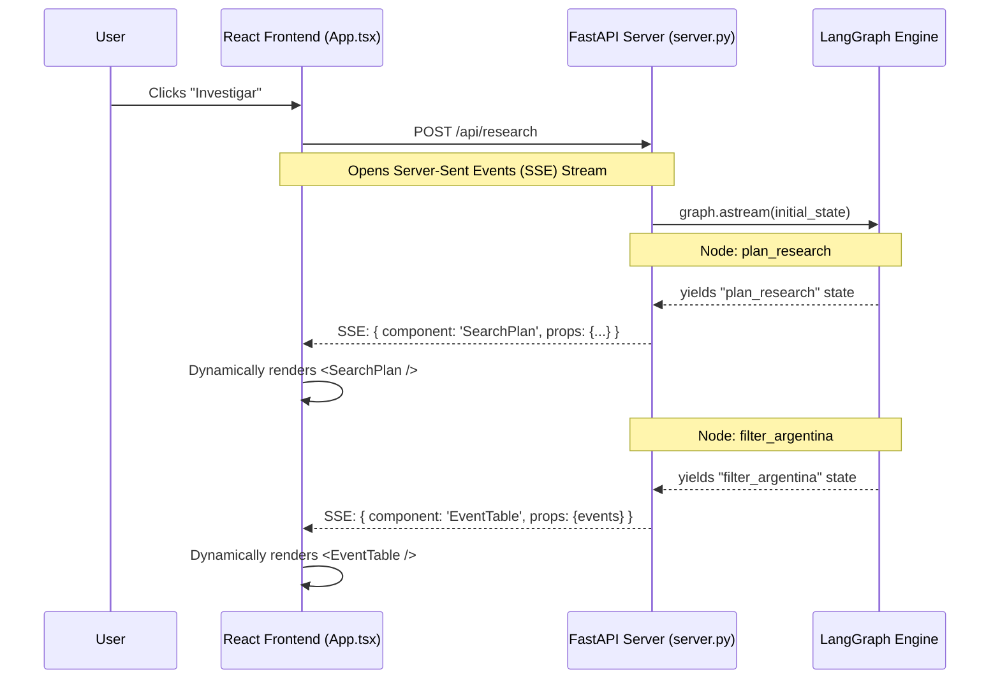

# Deep Research Agent - Eventos Argentina (Fullstack)

Este es un sistema multi-agente construido con LangGraph que busca y analiza eventos que generan tráfico masivo de internet en Argentina (como deportes, estrenos de streaming, torneos de gaming y entregas de premios).

## Características principales

- **LangGraph API:** Grafo de agentes paralelos de investigación.
- **Agent-to-UI (A2UI):** Interfaz frontend en React/Vite construida a base de Server-Sent Events (SSE). El backend controla cuándo y qué componentes renderiza el frontend según la fase de razonamiento del grafo.
- **Groq Llama 3:** Uso intensivo de modelos ultra-rápidos (`meta-llama/llama-4-scout-17b-16e-instruct`).
- **Tavily Search API:** Búsquedas web precisas para investigación.
- **Ontología de Negocios:** Archivo YAML que dicta exactamente qué eventos son relevantes para Argentina.
- **LangSmith Tracing:** Trazabilidad automática de todo el proceso y consumo de tokens.

---

## 🛠 Instalación y Uso Local

### 1. Variables de Entorno (`.env`)
En la raíz del proyecto, debes crear un archivo `.env` con las siguientes claves:

```env
GROQ_API_KEY=gsk_tu_clave_de_groq_aqui
TAVILY_API_KEY=tvly_tu_clave_de_tavily_aqui
LANGSMITH_PROJECT=deepResearch
LANGCHAIN_TRACING_V2=true
LANGCHAIN_ENDPOINT=https://api.smith.langchain.com
LANGCHAIN_API_KEY=ls__tu_clave_de_langsmith_aqui
```

> **Nota sobre Groq:** El modelo Llama utilizado en el modo gratuito ("on demand") tiene límites de uso. El script implementa un mecanismo de *Exponential Backoff* que pausa las consultas y las reintenta automáticamente si Groq devuelve error 429 (Rate Limit).

### 2. Levantar Todo (Fullstack en Desarrollo)

```bash
npm install
npm run dev
```
Esto lanzará simultáneamente mediante `concurrently`:
- **Backend (FastAPI):** `http://127.0.0.1:8000`
- **Frontend (Vite/React):** `http://localhost:5173`

> Podés navegar a la dirección de Vite (5173) y realizar una investigación indicando una fecha.

### Uso por CLI (Opcional)
Si querés probar la ejecución original en terminal sin levantar el servidor web:
```bash
cd backend
uv sync
uv run python main.py
```

---

## 🏗 Arquitectura del Grafo



## 📁 Estructura del Backend Central (`backend/`)

| Archivo | Propósito |
|---------|---------|
| `ontologia.yaml` | **🎯 REGLAS DE NEGOCIO:** Define exactamente qué torneos, equipos, plataformas y criterios hacen a un evento "relevante" en Argentina. |
| `graph.py` | Grafo de LangGraph y nodos de agentes. Incluye Retry Backoff para la API de Groq. |
| `server.py` | Servidor FastAPI con SSE (Server-Sent Events) para transmitir la UI (A2UI) en tiempo real al frontend. |
| `prompts.py` | Instrucciones de sistema para el Planificador, Investigador, Filtro y Reporte. |
| `state.py` | Definición de estado del Grafo y esquemas estructurados de Pydantic. |
| `configuration.py` | Configuración de los agentes, modelos a usar (Llama de Groq) y parámetros de búsqueda de Tavily. |

---

## 🖥 Arquitectura Frontend - A2UI Protocol

El proyecto utiliza un patrón donde el Backend FastAPI envía fragmentos JSON en el Stream (SSE) indicando qué componente y props debe montar la UI pasivamente.


